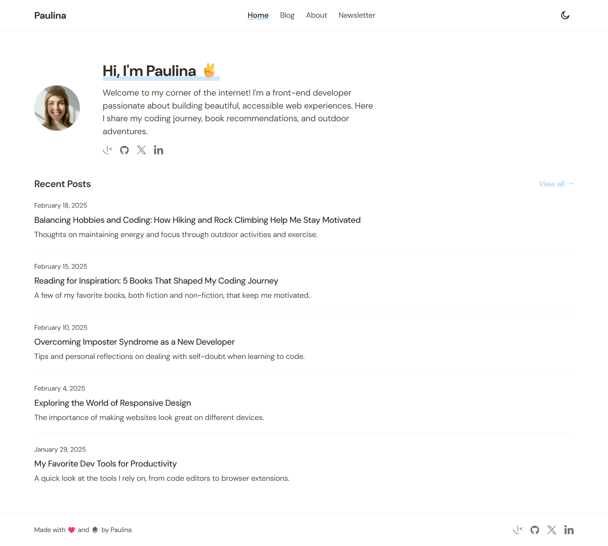

# Frontend Mentor - Personal Blog

My solution to the [Personal Blog challenge on Frontend Mentor](https://www.frontendmentor.io/challenges/personal-blog-oL7JOBSQe).

## Overview

### The challenge

Users should be able to:

- View the optimal layout for each page depending on their device's screen size
- See hover and focus states for all interactive elements on the page
- Toggle between light and dark mode
- Submit an email address to the newsletter form with client-side validation
- Read blog posts rendered from Markdown content
- Navigate between previous and next posts

### Screenshot



### Built with

- [Vite 6](https://vite.dev/) + [React 18](https://react.dev/) + [TypeScript](https://www.typescriptlang.org/)
- [Tailwind CSS v3](https://tailwindcss.com/) — CSS variable 2-layer pattern for theming
- [React Router v6](https://reactrouter.com/) — client-side routing
- [react-markdown](https://github.com/remarkjs/react-markdown) + [remark-gfm](https://github.com/remarkjs/remark-gfm) — Markdown rendering
- [Supabase](https://supabase.com/) — PostgreSQL database + RPC functions
- [shadcn/ui](https://ui.shadcn.com/) — component primitives

### What I built

**5 pages:**

| Page       | Route         |
| ---------- | ------------- |
| Home       | `/`           |
| Blog list  | `/blog`       |
| Blog post  | `/blog/:slug` |
| About      | `/about`      |
| Newsletter | `/newsletter` |

**Backend (Supabase):**

- `posts` table with Row Level Security (public read, authenticated write)
- `newsletter_subscribers` table for email collection
- 7 PostgreSQL RPC functions for data access and newsletter subscription
- Local development with Docker → deployed to Supabase Cloud

### What I learned

**CSS variable theming with Tailwind**

I used a 2-layer pattern to support light/dark mode without duplicating class names. CSS variables are defined in `index.css` using raw HSL channels (no `hsl()` wrapper), and Tailwind wraps them:

```css
/* index.css */
:root {
  --bg: 0 0% 100%;
  --text-primary: 26 7% 19%;
  --accent: 206 95% 78%;
}

.dark {
  --bg: 20 6% 10%;
  --text-primary: 0 0% 100%;
  --accent: 206 61% 67%;
}
```

```js
// tailwind.config.js
colors: {
  bg: 'hsl(var(--bg))',
  'text-primary': 'hsl(var(--text-primary))',
  accent: 'hsl(var(--accent))',
}
```

**Markdown rendering with custom components**

Blog posts are stored as raw Markdown in the database and rendered with `react-markdown`. I implemented custom renderers for callout blocks (`> **Warning:**`, `> **Tip:**`, `> **Information:**`) that map to styled alert components.

**Blue marker highlight effect**

To replicate the Figma design's underline highlight on headings and active nav links, I used a CSS `linear-gradient` background trick — no pseudo-elements needed:

```css
background: linear-gradient(transparent 78%, hsl(206 95% 78% / 0.45) 78%);
```

**Supabase RPC functions**

Instead of querying tables directly from the frontend, I wrapped all data access in PostgreSQL functions with `security definer set search_path = ''`. This keeps RLS policies clean and allows adding business logic server-side without changing the client API.

### Continued development

- Deploy to Vercel with Supabase Cloud as the database backend
- Add syntax highlighting for code blocks in blog posts
- Explore server-side rendering (SSR) with React Router or Next.js for better SEO

### Useful resources

- [Supabase local development](https://supabase.com/docs/guides/cli/local-development) — the local-first workflow (Docker → `db push` to Cloud) was key to testing safely before going live
- [react-markdown custom components](https://github.com/remarkjs/react-markdown#use-custom-components) — enabled the Callout block pattern

## Project Structure

```
src/
├── components/
│   ├── BlogContent.tsx      # Markdown renderer with custom Callout components
│   ├── BlogEntry.tsx        # Post card for listing pages
│   ├── Footer.tsx
│   ├── Navbar.tsx           # Sticky header with dark mode toggle + mobile menu
│   ├── NewsletterForm.tsx   # Validated form → Supabase RPC
│   ├── ScrollToTop.tsx      # Resets scroll position on route change
│   └── SocialIcons.tsx
├── hooks/
│   ├── usePosts.ts          # Supabase RPC hooks (useAllPosts, usePostBySlug, useRecentPosts)
│   └── useTheme.ts          # Dark/light mode with localStorage persistence
├── lib/
│   ├── supabase.ts          # Supabase client
│   └── utils.ts             # cn() utility
├── pages/
│   ├── AboutPage.tsx
│   ├── BlogDetailPage.tsx
│   ├── BlogPage.tsx
│   ├── HomePage.tsx
│   └── NewsletterPage.tsx
└── types/
    └── index.ts

supabase/
├── schemas/
│   ├── posts.sql
│   ├── newsletter_subscribers.sql
│   └── functions.sql
└── seed.sql                 # 8 sample blog posts
```

## Getting Started

### Prerequisites

- Node.js 18+
- [Supabase CLI](https://supabase.com/docs/guides/cli)
- Docker Desktop (for local Supabase)

### Local development

```bash
# Install dependencies
npm install

# Start local Supabase (requires Docker)
supabase start
supabase db reset   # applies schema + seed data

# Create .env.local with the local keys printed by supabase start
VITE_SUPABASE_URL=http://127.0.0.1:54321
VITE_SUPABASE_KEY=<anon key>

# Start dev server
npm run dev
```

### Deploy to Supabase Cloud

```bash
supabase link --project-ref <your-project-ref>
supabase db push
```

Then update `.env.local` (or your hosting provider's environment variables) with the Cloud URL and anon key from the Supabase Dashboard → Settings → API.
